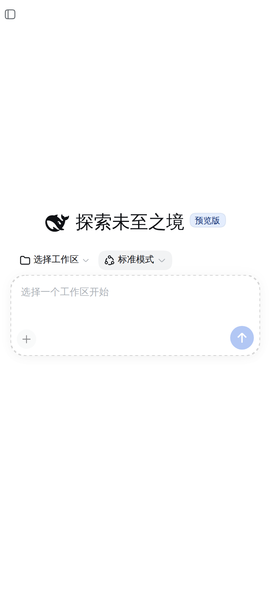
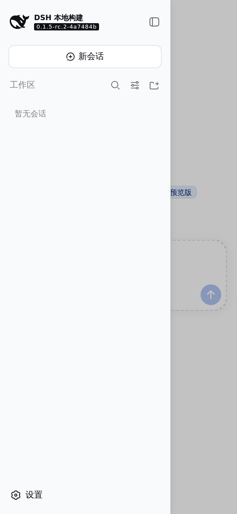
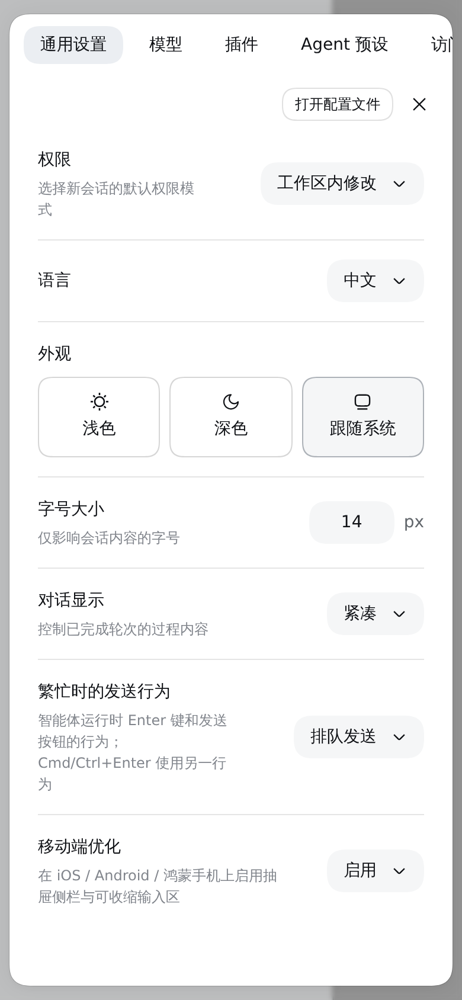
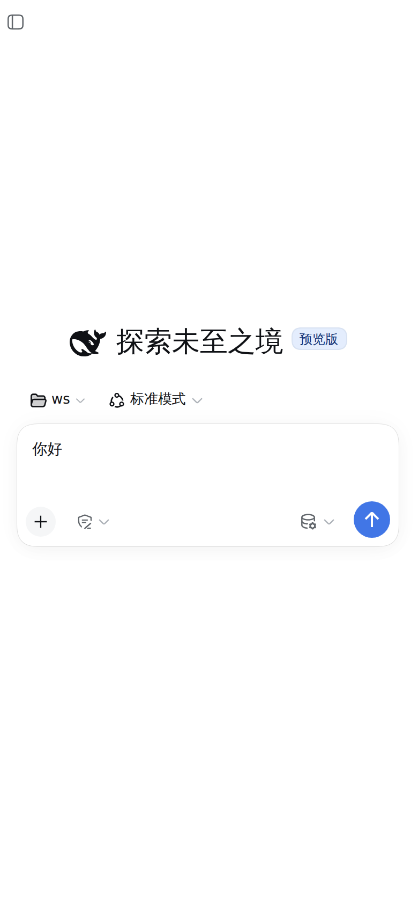
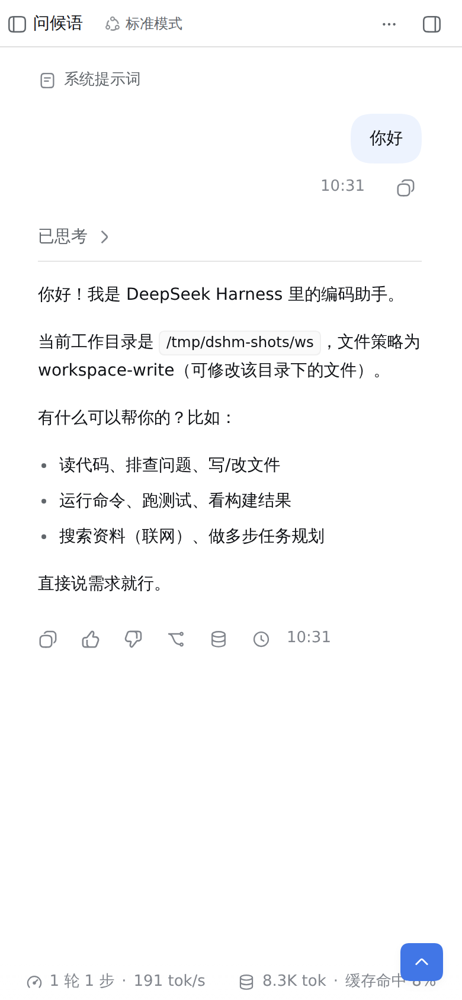
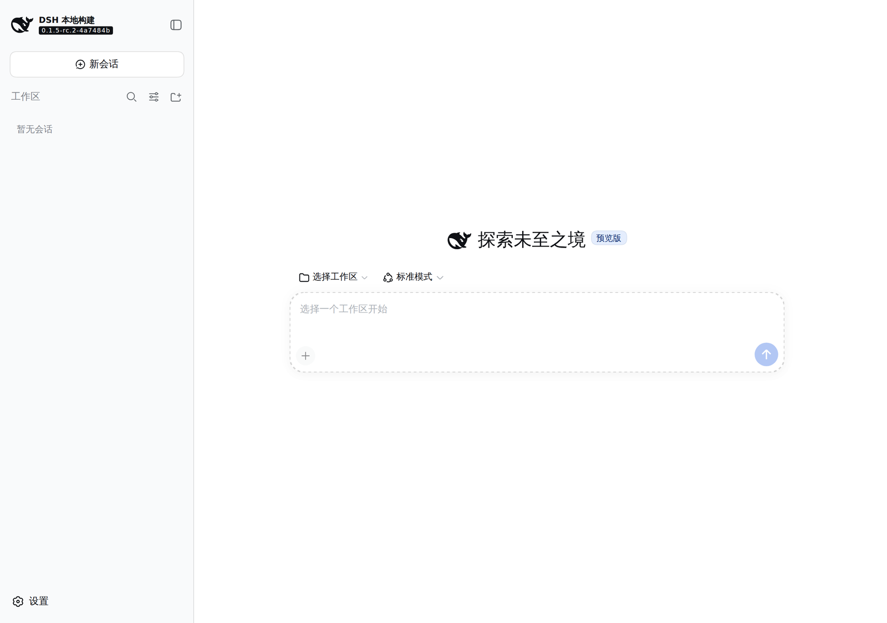

# dsh-mobile-ui

DSH Web GUI 的移动端 UI 优化插件（iOS / Android / 鸿蒙 UA 生效）：**左侧边栏改为悬浮抽屉**、**底部输入区可整体收缩为右下角圆点**。装了就生效，卸载后完全回到官方布局。

> 部署到别的机器、升级适配与排障：见 [DEPLOY.md](./DEPLOY.md)。

## 效果

截图为 390×844 手机视口（安卓 / 鸿蒙 UA）实拍本机 DSH Web：

| 手机 · 首屏 | 手机 · 侧栏抽屉 | 手机 · 设置整屏 |
| --- | --- | --- |
|  |  |  |

| 手机 · 输入区展开 | 手机 · 输入区收起 |
| --- | --- |
|  |  |

桌面端（1280×900 视口）与官方完全一致，看不到任何插件痕迹——`data-dshm` 属性不会出现，窄桌窗口同理：



## 它做了什么

| 区域 | 官方行为 | 本插件行为 |
| --- | --- | --- |
| **设置面板（手机）** | 800px 宽的弹窗里固定一条 188px 导航栏；在 390px 屏上 `max-width: calc(100vw - 48px)` 只剩 342px，内容列被挤到 **~106px**，中文标题逐字换行、外观三张卡片竖着堆 | 手机下面板变成**整屏抽屉**（`calc(100vw - 16px)` × `calc(100vh - 24px)`、圆角 20px、纵向排列），188px 导航栏变成顶部**横向滚动胶囊条**（32px 圆角胶囊、隐藏分区图标与「设置」大标题，内容列宽回到 **374px**），外观三张卡片改为**一行三张**（每张 103px）。全部写在 `html[data-dshm] [role='dialog'][aria-modal='true']` 作用域内，**跟随「移动端优化」开关**：停用即回到官方弹窗布局。实测面板 374×820 @x8、导航 `flex-direction: row` 374×42、内容列 374、外观卡 103 宽，桌面端不受影响 | **坑（已修）**：面板改成纵向排列后，内容列作为列方向 flex 子项默认保持内容高度（`min-height: auto`），超出部分被面板的 `overflow: hidden` 直接裁掉、内部滚动区拿不到视口——表现就是「设置里不能上下滑动」。补 `flex: 1 1 0; min-height: 0; overflow: hidden` 后恢复滚动，实测滚动区 `scrollHeight 828 / clientHeight 724`、可滚到 104（到底） ✓
| **设置 → 通用：移动端优化（启用 / 停用）** | 官方无此项 | 插件在 `settings.general.item` 里注册一行「移动端优化」，用官方同款偏好行样式（标题 14/22 primary、说明 12/18 tertiary、16px 纵向内边距、0.5px 分隔线）＋ 一个胶囊选择器（36px 高、圆角 18px、官方 `--dsw-alias-bg-module-platform` 底），点开是官方的 Menu，两项 **启用 / 停用**（当前项带勾）。选择写入 `localStorage['dsh-mobile-ui.enabled']`（按浏览器保存，桌面不会读）；**停用立即回到官方布局**（撤掉 `<html data-dshm>`、帧变量、抽屉与圆点，并把被抽屉收起的官方侧栏恢复展开），启用立即恢复。实测：停用后 `data-dshm=false`、`--dshm-columns` 被清空、localStorage 记为 `off`；重新启用后回到 `0px minmax(0,1fr) 0px`，控制台零报错 |
| 左侧边栏（收起） | 常驻 56px 图标轨道，占掉会话宽度 | 不占轨道，会话铺满整宽；左上角一个 28×28 圆钮把手，与右上角官方「右侧栏」按钮**互为镜像**（同 28×28 圆、同 6px 内边距、同 15×15 字形、同 y 11–39、图标各自居中、无底色无边线；hover 底色仅指针设备生效，避免触摸端点完残留深色底），图标是官方 `IconPanelLeftOutline16` 未翻转版（官方那颗 `scaleX(-1)`，两颗正好左右对称）；**纵向带位也由适配器实测**——取 `[data-sidebar-right-expand]` 的 `top` 写入 `--dshm-handle-top`（实测 6px），所以头部内边距怎么调整，两颗始终同带（实测均为 `y 6–34`、中心 20、28×28） |
| 左侧边栏（展开） | 挤压中栏，390px 手机上中栏只剩 110px | 作为抽屉覆盖在中栏之上（宽度随官方偏好），点遮罩收起 |
| 切换会话 / 全局面板 | — | 自动收起抽屉 |
| 底部输入区 | 输入框 + 工具行常驻底部 | 默认收起，只在右下角留一个蓝色圆点；点圆点展开官方输入框、工具行与发送按钮，再点收起 |
| 收缩/展开钮 | — | **两态同一控件、同一座位、同一尺寸**：36×32 圆角矩形（折叠时高度改由适配器按任务卡高度给出，内收 3px 后同为 32），同一图标族（收起态箭头朝上=展开，展开态朝下=收起）；**收起态底色用蓝色**（与发送钮同款 `--dsw-alias-button-info-fill`、白色图标，收起后它是屏幕上唯一的行动点），展开态换成卡片工具行同款灰底 |
| 展开态布局 | 输入框下方一行放 ＋ / 权限 / 模型 / 上下文环 / 发送 | 输入卡片**紧邻收缩钮左侧**（只留 8px 缝），卡片退成「输入框 + 发送/停止」；原工具行的四个功能**悬浮在收缩钮正上方**，竖排、与收缩钮同款 **36×32** 圆角矩形（圆角 9px、同底色同边框、同列宽同间距 6px、左边缘对齐，整列读作一套控件），点开仍是官方菜单；**发送/停止仍留在卡片右下角里**。右侧让位不是固定值：适配器每次刷新按**工具列左边缘**实测出 `--dshm-rail-inset`，并且**展开/收起两态都生效**（收起时那一列站着收缩钮）。各卡片自身的内边距不同（输入卡 16px、排队卡 24px、任务卡 32px），所以插件把 `[data-testid='todo-panel']`、`[data-goal-bar]` 统一按 `--dsh-composer-side-clearance`（16px）对齐到输入卡那一条带（实测 `x 16–330`、距控制列 8px）。**三张 dock 卡的分态关系**：展开态——**任务卡与队列卡同宽同位**（都是可见卡 `32–314`，宽 282，官方 dock inset 8px 的内缩形态），输入卡仍是 `16–330`，即两张 dock 卡相对输入卡内缩一档；收起态——**任务卡、队列卡、输入卡三者同宽**（`16–330`，宽 314），队列卡另补圆角 12px 与底部 0.5px 描边（官方面板只有上圆角、无下边框，因为它原本要与输入卡拼合），高度也收到 38（官方 36px 头部行 + 2px 内缩 = 40）。实测：展开 `queue 32–314 / todo 32–314`，收起 `queue 16–330 / todo 16–330 / 高均 38`
| 底部统计行（轮/步/tok/s） | 常驻 | **仍然常驻**，折叠态下也不隐藏，排在圆点下方 | 手机上这一行**加宽并居中到输入卡片那条中线**：它自身的宽度比容器少一个 `--dsh-composer-side-clearance`×2，且座位为上方卡片预留了控制列，因此原本落在 `x 16–330`（宽 314）。适配器取回这两段宽度（`width: calc(100% + clearance×2)`），再实测一个 `--dshm-stats-shift` 把行中心对到**输入卡片的中线**（按未位移的盒子反算，避免反馈；卡片、排队卡、任务卡都在这一列上）。手机上这一行**顶满屏幕、内容居中**：`width: calc(100% + clearance×2 + rail-inset)` = 388px（行盒 `1–389`，整帧宽），左右内边距各收到 8px，行中心由适配器实测 `--dshm-stats-shift` 对到框架中心（按未位移盒子反算，避免反馈）。实测：胶囊组 `9–381`（左右留白 9/9 对称）、中心 **195 = 屏幕中心**，单个胶囊 191.2 / 168.8（原 126/112），文案 `45 turns 593 steps …` / `268M tok · Cache…`。**物理上限说明**：三段数值 + 图标在 11px 字号下约需 454px，而 390 屏可用仅 372px，因此仍会有省略号；要"全部显示"只能换行（行高 26 → 52px）或砍掉一项指标。（曾试过把两组改成等宽 `flex: 1 1 0`，让两组之间的缝隙精确落在屏幕中心；**已按用户要求回退**，两组恢复按内容定宽 —— 实测左 186 / 右 174、外侧留白 9/9、缝隙中心 201（比中心右 6px，随文案长度浮动）。）
| 列宽拖拽手柄 | 桌面用 | 手机框架下隐藏 |
| 顶部「对话 / 轨迹」选项卡 | 会话头部一整行 | 手机下**整行隐藏**，并且把头部高度从官方的固定 76px 改由适配器实测的 `--dshm-header-h`（= 标题行高 + 头部上下内边距，实测 **40px**）驱动——官方头部高度是按「标题行 + 选项卡行」写死的常量，只隐藏选项卡会把那一行的高度留在原地。实测：头部 76 → 40px，会话滚动区顶部 76 → **40px**，真正收回 36px。另外官方头部**只给上内边距**（`10px/0px`），标题行下沿贴着头部底边。按**墨迹**实测（4× 截图逐行扫描，屏除边框）四种分配：A 官方 `10/0`（头 40）墨迹上 17.5 / 下 9（差 8.5 ✗）；B 只补底部 `10/10`（头 50）上 17.5 / 下 19（差 1.5 ✓ 但头部高了 10px ✗）；**C 在 40px 内重新分配 `5/5`（头 40）上 12.5 / 下 14（差 1.5 ✓ 且高度不变 ✓）**；D 折中 `7/7`（头 44）上 14.5 / 下 16 ✓。定稿取 C：`padding: 5px 0` + 代理实测 `--dshm-header-h`（40），标题文字上下留白由 17.5/9 变为 12.5/14，头部高度与官方一致、会话区起点仍 y 40。
| 右侧滚动条 | 会话/输入框等滚动区带滚动条与预留槽位 | 手机上全部隐藏（`scrollbar-width: none` + `::-webkit-scrollbar` 零宽），改由触摸滑动；实测所有滚动容器 `offsetWidth - clientWidth = 0`，页面无横向溢出 |
| 右侧面板的页签条 | — | 隐藏顶部选项卡的规则**必须限定在会话头部**（`[data-phase] header [role='tablist']`）：右侧栏（文件管理）自己的面板页签同样是 `[role='tablist']`，早期版本一并被 `display: none` 隐藏，导致面板里只剩刷新按钮、收起（返回）按钮消失；收窄选择器后实测右栏页签条恢复（`Files`/`+`/收起按钮，390×38、display flex） |
| ⋯ 菜单里的视图切换 | — | 注入时**只认头部 ⋯ 那一个菜单**：先要求 `[data-phase] header button[aria-haspopup='menu'][aria-expanded='true']` 存在，否则直接返回——权限/模型等选择面板同样是 `[role='menu']`，早期版本会被误注入（权限面板里多出一行「轨迹」）；修复后实测权限面板只剩 Read Only / Workspace Write / Full access，而 ⋯ 菜单仍为 Trajectory + Download session log |
| 点工具列按钮时 | 官方控件会 preventDefault 并聚焦输入框（手机弹键盘、菜单被顶出屏幕） | 工具列在捕获阶段吞掉 mousedown（click / pointer / touch 照旧透传），点 ＋ / 权限 / 模型 / 上下文环都不弹键盘，官方菜单留在屏幕内（实测命令面板 `y 362–754`，全部可见） |
| 从工具列点开的选择面板 | 贴着触发器向右下展开 | 三个面板（权限/模型/上下文）**右边缘统一停在距屏幕右缘 8px**（实测都是 `right 382`）：官方锚点会与 36px 触发器列右缘齐平（`374`），硬边看着像被切掉；适配器按**未位移**的盒子算出 `--dshm-shift`（`translate` 叠加在官方动画的 transform 上），越界的权限面板左移、齐平的模型/上下文面板右移 8px，三者一致（`right 382`，全在屏内）。 触发钮贴在框架右缘，面板会自动向左平移到框内（实测权限面板 x 164–382、宽 218，模型面板 x 126–374、宽 248），不溢出屏幕右缘；面板里是**文字列表**（Read Only / Workspace Write / Full access），不是图标——工具列的 chip 样式用 `:not([role='menu'] *)` 把菜单项排除在外，否则 36px 的 chip 盒子会把选项挤成图标 |

只在「UA 命中 iOS/Android/鸿蒙」且「框架宽度 < 1024px」时生效；桌面浏览器、窄桌窗口一律保持官方布局。

**收缩钮与发送钮垂直居中（0.2.2 修）**：展开态下收缩钮原按「卡片底 + 8px」定位，32px 高 → 中心落在卡片底 + 24px；发送钮是 34px 圆钮钉在卡片底上 9px → 中心在卡片底 + 26px，两者差 **2px**（屏幕越大越明显，MatePad mini 690×1035 实测 −2px）。改为适配器量取发送钮**实测中线**写入 `--dshm-fab-bottom`（与「回到最新」同一套做法），CSS 用该值定位、旧的「卡片底 + 8px」留作回退；收起态没有发送钮，收缩钮仍用自己的座位。页面内注入验证：`delta −2 → 0`、`bottom 38px → 40px`。

## 安装（本机 / 分享给别人）

本插件是**标准的 DSH profile 插件包**：仓库不动一行官方代码，安装只写用户级 profile（`~/.dsh/profiles/<name>/`），升级 DSH 时不会与官方文件冲突。

```sh
# 一条命令安装：包声明了 dsh.bundle.patch，CLI 会自动把它并入 profile 的 bundles 层栈
dsh plugin --profile web add dsh-mobile-ui                 # npm 上（发布后）
dsh plugin --profile web add github:<user>/dsh-mobile-ui   # 或 git
dsh plugin --profile web add /path/to/dsh-mobile-ui        # 或本地目录 / tarball

# 首次安装后重启一次（bundles 层栈在进程启动时组装；profile 补丁层才是热加载）
systemctl --user restart dsh-web
```

不想重启时，也可以走**profile 补丁层热加载**（本机就是这么装的，浏览器刷新即生效）：

```sh
P=~/.dsh/profiles/web
ln -sfn /path/to/dsh-mobile-ui $P/node_modules/dsh-mobile-ui
node -e "const f=process.env.HOME+'/.dsh/profiles/web/package.json';const fs=require('fs');const m=JSON.parse(fs.readFileSync(f,'utf8'));m.dependencies['dsh-mobile-ui']='file:/path/to/dsh-mobile-ui';fs.writeFileSync(f,JSON.stringify(m,null,2)+'\n')"
# 再往 $P/cordis.patch.yml 末尾追加： - insert: [{ id: mobile-ui, name: dsh-mobile-ui }]
```

## 卸载

```sh
dsh plugin --profile web remove dsh-mobile-ui
systemctl --user restart dsh-web          # 已挂载的行需要冷启动才会卸载（热加载只增不减）
```

走补丁层安装的，删掉 `cordis.patch.yml` 里那段插入项再重启即可。卸载后不残留任何痕迹：`<html data-dshm>`、框架上的 `--dshm-*`、注入的 `<style>`、两个 `shell.overlay` 条目都随插件生命周期移除（`createAdapter` 的 dispose 已覆盖；profile 不带该行时更是完全不加载），页面立刻回到官方布局。

## 升级适配（DSH 升级后怎么快速跟上）

插件只依赖**官方公开的 DOM 缝**（`data-*` 属性）与公开的客户端模块（`react`、`@deepseek-ai/dsh-client-*`），不 import 任何官方源码路径，也不改官方文件——所以 DSH 升级本身不会与它冲突。升级后万一官方重命名了某个属性，按下面三步收敛：

1. **看控制台**：插件第一次在手机 UA 上接管时会自检结构缝，缺哪个会直接报名字 ——
   `[mobileUi] DSH DOM seam missing: card [data-composer-card] — this DSH build renamed them, update SEAMS in client.js`
2. **只改一张表**：全部上游选择器集中在 `client.js` 顶部的 `SEAMS` 字典（13 条），改名通常就是改一个字符串；
3. **跑一遍自检**：`node --test`（含 `names the upstream seam that a future DSH build renames`）＋ 手机刷新看布局。

适配基线：**DSH 0.1.5-rc 系（本机 2026-09-21 实机验证）**，鸿蒙 390×844。


## 实现方式（为什么不动官方代码）

插件不修改任何官方包，全部通过公开面接入：

- **插槽**：往 `shell.overlay` 注册两个条目（抽屉把手/遮罩、输入区圆点），locale 与状态经 `inject`、`hooks` 下发；
- **服务**：抽屉开关用公开的 `ctx.layout.toggleSidebar()`；会话/面板变化经标准 `useSessions`、`usePanelInfo` 观察；
- **稳定 DOM 缝**：框架靠 `[data-shell-overlay]` 的父元素定位，状态读 `[data-sidebar-collapsed]`、`[data-phase]`，输入区靠 `[data-composer-card]`、`[data-composer-stats]`、`[data-conversation-scroll]`、`[data-chat-flow]`；
- **样式**：注入一段作用域为 `html[data-dshm]` 的样式表，用 `--dshm-columns` 把框架自己的三轨模板「左轨归零」后交给 `grid-template-columns`（`!important` 才能压过内联样式），因此右栏轨道仍按官方求解结果保留。

官方若改动上述缝，坏的只会是这个插件，卸载即恢复官方；升级 DSH 不需要动插件之外的任何文件。

## 已知取舍

- 折叠态下"停止生成"要多一步：点圆点展开后才看得到官方的 Stop 按钮。
- 抽屉不是模态框：不锁焦点、不隐藏被覆盖内容（遮罩与栏内自带的切换控件负责收起）。
- 依赖官方样式缝，属于「适配层」而非「官方功能」；官方大改布局时可能需要跟着改选择器。
- 官方「回到最新」（back to bottom）浮钮原本右对齐到框架边缘，正好压在工具列第 4 个 chip 上（实测重叠 10px）。适配器按**当前态的圆形控件**把它的中线对齐：展开态对齐**发送钮**、收起态对齐**收缩钮**（都实测中线偏差 0；位移量 `--dshm-to-bottom-shift` 由 slot 右边缘反算，避免位移反馈进下一次测量，收起态为 `-17px` 即右移 17px 与蓝色钮同列），面板/按钮位置由该变量驱动并带 180ms 过渡；与工具列零重叠。
- 收缩钮两态**同一座位**：底距 = 卡片底距(30px) + 8px = 38px，收起时沿用展开时量到的值，所以收起来不会往下沉。折叠态「深度求索…」状态行与悬浮钮**同一水平中线**：原来是状态行中心 y 785、按钮 y 790（差 5px）；适配器不动按钮座位（避免折叠/展开位移），而是给会话流 `margin-bottom: -5px`，让内容末端在官方那 16px 间距里再下移 5px（实测流底 798 → 803，仍留 11px），状态行中心变成 **790 = 按钮中心 790**，两者并排一行；常驻统计行仍 y 814–840 未动。折叠态聊天流底部**不做预留**（`padding-bottom: 0`）：收缩钮是悬浮层（`position: fixed`），会话直接滚到滚动区底部、末行从它下面经过，官方"会话流与输入区之间 16px"的间距仍保证末行不会顶到常驻统计行。实测末行内容底边由预留版的 `y 770` 降到 `y 798`（多收回 28px），与统计行顶（814）间距 16px。早先版本为了"末行完整让开按钮"预留 28–34px，那条带看起来就永远空着一块。
- 折叠态收缩钮**只改高度、不改座位**：适配器量 `[data-testid='todo-panel']` 的高度写入 `--dshm-dock-h`（不在 28–44px 内视为「列表已展开/无任务卡」，保留上次值），按钮高度取 `dockH - 2×3px` 并带 180ms 高度过渡；`bottom` 两态都用同一个座位（`--dshm-card-bottom + 8px`），所以收放时**下沿钉死不动**，只有上沿 2px 的形变。聊天流底部预留为 `--dshm-dock-h - 4px`。内收 3px 的理由：实心高饱和蓝在同一高度下比深灰平面卡视觉上大约 2px，等高会显得按钮偏大。早先版本把折叠态座位也对齐到任务卡中心线（高出座位 5px），每次收起按钮都会往上飘一下，已改回同一座位。
- 折叠态卡片**必须裁剪**（`overflow: hidden`）：否则卡片里那些还在、只是透明的草稿行/工具行会被算进滚动容器的溢出，会话能多滚约 25px，常驻统计行看起来"浮在半空"。实测修复后折叠与展开两态的统计行底距都是 4px（贴底）。
- 发送/停止圆钮锚定卡片**右下角**（距卡片底 9px），草稿长高时卡片向上长、圆钮不跟着上移（实测 1 行 52px / 5 行 137px 卡片，圆钮底距始终 9px）。
- 展开/收起有过渡动画：卡片按**实测高度**做 max-height 缓动（240ms）+ 淡出（裁剪只在缓动期间内联挂上，落定即摘掉——常驻 `overflow: hidden` 会把卡片上方弹出的命令面板整块剪没）；工具列四个功能钮**逐个错峰**（展开自上而下 0/35/70/105ms，收起自下而上反向），发送/停止钮单独 40ms 延迟淡入。适配器给每个功能钮标 `--dshm-i` 序号驱动错峰，过渡结束清掉内联高度，多行草稿不会被削。收起态的整列用 `inert` 关闭交互（不做 visibility/display 切换——浏览器对未绘制元素不跑过渡，那会让展开变成硬切）。实测展开逐帧 `[1.00, 0.97, 0.85, 0.53]`、收起 `[1.00, 0.90, 0.37, 0.09]`，`prefers-reduced-motion` 下直接切换。
- **动画参数集中在一处**（`html[data-dshm]` 上的五个变量，便于整体调快慢）：`--dshm-card-grow: 240ms`（卡片高度 + 内边距）、`--dshm-card-fade: 170ms`、`--dshm-input-move: 200ms`（输入区水平位移）、`--dshm-item-move: 200ms` / `--dshm-item-fade: 170ms`（竖向按钮与发送钮）；工具列错峰 `--dshm-item-step: 15ms` + `--dshm-chip-move: 200ms` / `--dshm-chip-fade: 170ms` 刻意凑成 3×15+200 = 245ms ≈ 卡片窗口：第四颗按钮与卡片同时落位，整段动作没有拖尾、`--dshm-item-fade: 260ms`、`--dshm-item-step: 50ms`（工具列错峰步长）。**两个方向的动作**：竖直"从下往上"= 卡片 `max-height` 0↔实测高度（同时内边距 0↔8px 一起过渡）；水平"从右往左"= 输入区 `translate: 28px → none`、工具列按钮与发送/停止钮 `translate: 16px 12px → none`。实测展开逐帧：高度 0→10→50→52、输入区 x 28→20.7→0.46→0；收起反向 ✓
- **长会话自动降级（性能）**：卡片高度动画每一帧都会让会话区域重排 + 重绘，代价随会话渲染量增长——同一个插件在**新会话里很顺、在长会话里发卡**就是这个原因。适配器在切换前量一次 `[data-chat-flow]` 的渲染节点数，**超过 600** 就不再逐帧改高度（只在一步里改掉盒子），仅保留合成器友好的淡出与位移（`opacity` / `translate`），手势一致但不再逐帧重排；短会话（会话记录轻）仍然走完整的"从下往上 + 从右往左"。阈值是 `ANIMATED_NODES_MAX` 一个常量。实测本长会话（89 轮 / 2931 节点）切换：高度一步到 0，`opacity 1.00→0.65→0.07→0.00`、`输入区 x 0→6.6→24.1→28px`，全程仅 1 帧超过 30ms
- **坑（已修）**：原先给展开态卡片写了 `min-height: 52px` 来撑单行内容带——CSS 里 min-height 优先于 max-height，于是**展开时高度根本不动画**（收起正常，因为收起态没有该 min-height），表现为"开的时候是硬切"。改为用上下各 8px 内边距凑出同样的 52px 带（36px 输入 + 16px），并把 `padding` 加进过渡，展开的高度动画才真正生效。

## 验证

单元测试（`node --test`，4 项）：UA 判定、三轨模板解析、样式缝选择器守护。

真实界面验证（Playwright，对运行中的本机 GUI）：

| 场景 | 结果 |
| --- | --- |
| 鸿蒙 UA 390×844 / iPhone UA 393×852 / 鸿蒙横屏 844×390 | 插件生效：框架 `0px 390px 0px`、会话铺满、抽屉可开合、圆点可展开/收起、可正常输入草稿 |
| 抽屉打开 | 侧栏 `position: fixed`、宽 281px、遮罩可收起；选中会话后自动收起 |
| 折叠态 | 输入卡片 `display: none`、统计行仍 `display: flex` 常驻、圆点位于右下角 |
| 桌面 UA 2560×1440 | 插件不生效：无 `data-dshm`、无把手/圆点、官方 `280px 2280px 0px` 布局 |
| 冷启动（带该行） | 插件生效 |
| 冷启动（删掉该行） | 官方布局：`56px 334px 0px`、侧栏 static、输入卡片正常显示 |
